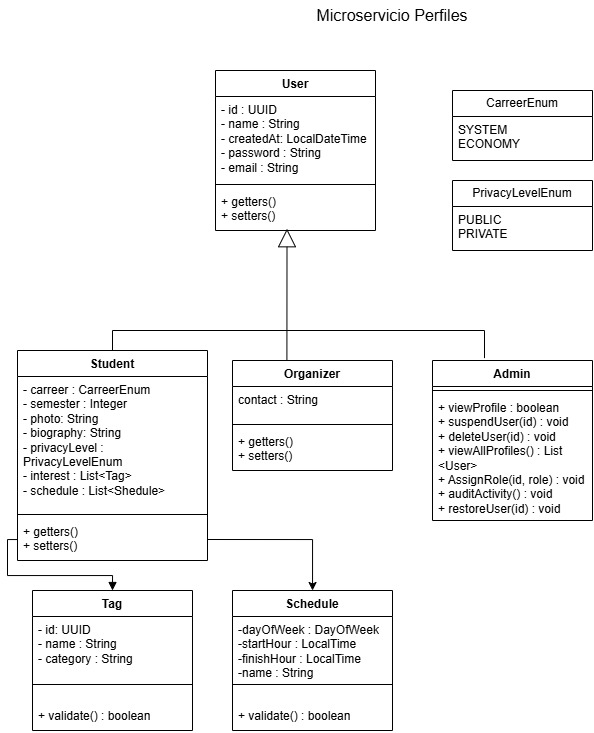
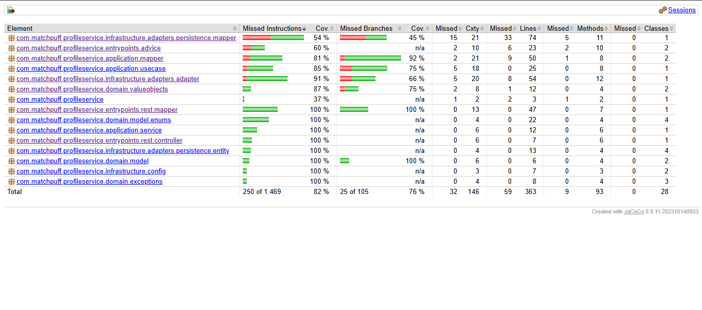

# matchpuff-profile-service

## Gestión del perfil de usuario y flujo de onboarding

### Tecnologías utilizadas
- Java 21
- Spring Boot 3.2.5
- Maven
- MongoDB (Spring Data MongoDB)
- Lombok
- SpringDoc OpenAPI (Swagger UI)
- JPA/Hibernate
- H2 Database (desarrollo)

### Descripción del módulo
Este microservicio gestiona la información del perfil de usuario y el flujo de onboarding, siguiendo principios de Clean Architecture.

### Funcionamiento del módulo
- Arquitectura basada en capas (Clean Architecture): dominio, aplicación, infraestructura y entrada.
- Utiliza DTOs, mapeadores y servicios para la lógica de negocio.
- Otros módulos pueden consumir sus endpoints REST para la gestión de perfiles.

### Diagramas
- Diagrama de clases:




- Diagrama de componentes: [pendiente de agregar]
- Diagrama de datos: [pendiente de agregar]

### Documentos

- Documento arquitectura del modulo: [Documento](https://pruebacorreoescuelaingeduco-my.sharepoint.com/:w:/g/personal/sebastian_castillejo_mail_escuelaing_edu_co/IQCPPqZzkTezQrTJagqLVwoMARS8WWGVVkfmjgsj1g04NI0?e=78CM4b)


### Funcionalidades
- Registro y actualización de perfil de usuario
- Gestión del flujo de onboarding
- Validación de datos y manejo de errores

### Endpoints expuestos

#### `POST /api/users` — Crear usuario

Crea un nuevo perfil de estudiante.

**Request body:**
```json
{
  "name": "Juan Romero",
  "email": "juan.romero@escuelaing.edu.co",
  "gender": "MALE",
  "carreer": "SYSTEMS_ENGINEERING",
  "semester": 7,
  "photo": "https://cdn.example.com/foto.jpg",
  "biography": "Estudiante apasionado por el software.",
  "privacyLevel": "PUBLIC",
  "dateOfBirth": "2001-03-15",
  "tags": [
    { "name": "Fútbol", "category": "Deportes" }
  ],
  "schedules": [
    { "dayOfWeek": "MONDAY", "name": "Clase de DOSW", "startTime": "08:00", "endTime": "10:00" }
  ]
}
```

**Valores aceptados:**
| Campo | Valores |
|---|---|
| `gender` | `MALE`, `FEMALE`, `PREFER_NOT_TO_SAY` |
| `carreer` | `SYSTEMS_ENGINEERING`, `COMPUTER_SCIENCE`, `INFORMATION_TECHNOLOGY`, `ADMINISTRATION`, `BUSINESS` |
| `privacyLevel` | `PUBLIC`, `PRIVATE`, `FRIENDS_ONLY` |
| `dayOfWeek` | `MONDAY`, `TUESDAY`, `WEDNESDAY`, `THURSDAY`, `FRIDAY`, `SATURDAY`, `SUNDAY` |

**Happy Path — `201 Created`:**
```json
{
  "id": "664f1a2b3c4d5e6f7a8b9c0d",
  "name": "Juan Romero",
  "email": "juan.romero@escuelaing.edu.co",
  "createdAt": "2024-05-05T10:30:00",
  "userType": "STUDENT"
}
```

---

#### `GET /api/users/{userId}` — Obtener usuario por ID

**Happy Path — `200 OK`:**
```json
{
  "id": "664f1a2b3c4d5e6f7a8b9c0d",
  "name": "Juan Romero",
  "email": "juan.romero@escuelaing.edu.co",
  "createdAt": "2024-05-05T10:30:00",
  "userType": "STUDENT",
  "gender": "MALE",
  "dateOfBirth": "2001-03-15",
  "biography": "Estudiante apasionado por el software.",
  "schedules": [
    { "dayOfWeek": "MONDAY", "name": "Clase de DOSW", "startTime": "08:00", "endTime": "10:00" }
  ],
  "tags": [
    { "name": "Fútbol", "category": "Deportes" }
  ]
}
```

---

#### `PATCH /api/users/{userId}` — Actualizar datos del usuario

Recibe los mismos campos que `POST /api/users`. Solo los campos enviados se actualizan (patch parcial).

**Happy Path — `200 OK`:** devuelve el perfil completo actualizado con la misma estructura que `GET /api/users/{userId}`.

---

#### `GET /api/users` — Obtener todos los usuarios

**Happy Path — `200 OK`:** devuelve un arreglo de perfiles con la misma estructura que `GET /api/users/{userId}`.

---

#### `PATCH /api/users/{userId}/schedule` — Agregar un horario

**Request body:**
```json
{
  "dayOfWeek": "FRIDAY",
  "name": "Proyecto integrador",
  "startTime": "14:00",
  "endTime": "16:00"
}
```

**Happy Path — `200 OK`:** devuelve el perfil completo con el nuevo horario incluido en el arreglo `schedules`.

---

#### `PATCH /api/users/{userId}/tags` — Agregar un tag/interés

**Request body:**
```json
{
  "name": "Ajedrez",
  "category": "Juegos de mesa"
}
```

**Happy Path — `200 OK`:** devuelve el perfil completo con el nuevo tag incluido en el arreglo `tags`.

---

### Manejo de errores

Todos los errores devuelven la siguiente estructura:
```json
{
  "message": "Descripción del error",
  "status": 400,
  "timestamp": "2024-05-05T10:30:00"
}
```

| Situación                                                       | Código HTTP | Mensaje de ejemplo |
|-----------------------------------------------------------------|---|---|
| Campo inválido o faltante (`@NotNull`, `@Email`, `@Size`, etc.) | `400 Bad Request` | `"email: must be a well-formed email address"` |
| Correo que no pertenece al dominio `@mail.escuelaing.edu.co`    | `400 Bad Request` | `"email: must match .*@escuelaing\\.edu\\.co$"` |
| Semestre fuera del rango 1–10                                   | `400 Bad Request` | `"semester: El semestre máximo es 10"` |
| Biografía mayor a 200 caracteres                                | `400 Bad Request` | `"biography: La biografía no puede superar 200 caracteres"` |
| Fecha de nacimiento en el futuro                                | `400 Bad Request` | `"dateOfBirth: must be a past date"` |
| Usuario no encontrado                                           | `404 Not Found` | `"Usuario no encontrado: <id>"` |
| Usuario ya existe                                               | `409 Conflict` | `"El usuario ya existe"` |
| Error interno del servidor                                      | `500 Internal Server Error` | `"Error interno del servidor"` |

### Mensajería
- Pendiente por hablar

### Evidencia de pruebas
- 
### Ejecución del proyecto
1. Clonar el repositorio
2. Configurar las variables de entorno:
   - `MONGO_URI`: URI de conexión a MongoDB
   - `MONGO_DB` (opcional, default: `profileservice`): nombre de la base de datos
3. Ejecutar `mvn clean install`
4. Ejecutar la aplicación con `mvn spring-boot:run` o desde la clase principal
5. La documentación Swagger estará disponible en `http://localhost:8080/swagger-ui.html`

### Evidencia de despliegue CI/CD
- 

### Organización del código
- El código está organizado en las siguientes carpetas:
	- `application`: Lógica de aplicación, DTOs, servicios, mapeadores
	- `domain`: Modelos de dominio, excepciones, puertos
	- `infrastructure`: Adaptadores, configuración, persistencia
	- `entrypoints`: Controladores REST, mapeadores, WebSocket

### Documentación del código
- Cada función, propiedad y clase debe tener comentarios de documentación.

### Conexiones con servicios externos
- MongoDB: base de datos principal para persistencia de perfiles (URI configurada mediante variable de entorno `MONGO_URI`)

### Pruebas y cobertura

### JACOCO




### SONAR CUBE


### Pipelines
- El repositorio debe tener dos pipelines: uno de desarrollo y otro de producción.

---
*En proceso :<.*
