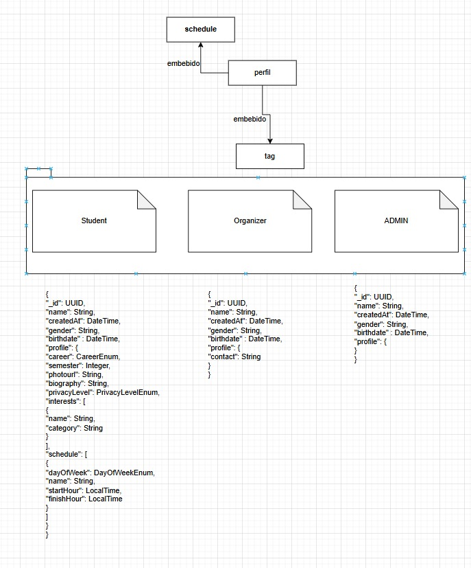
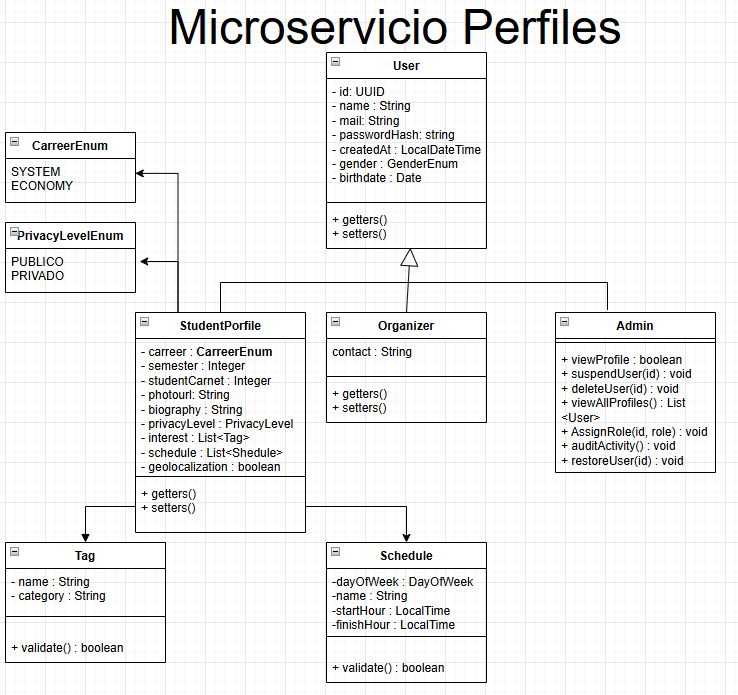
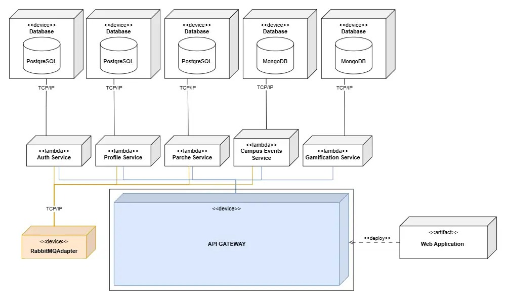
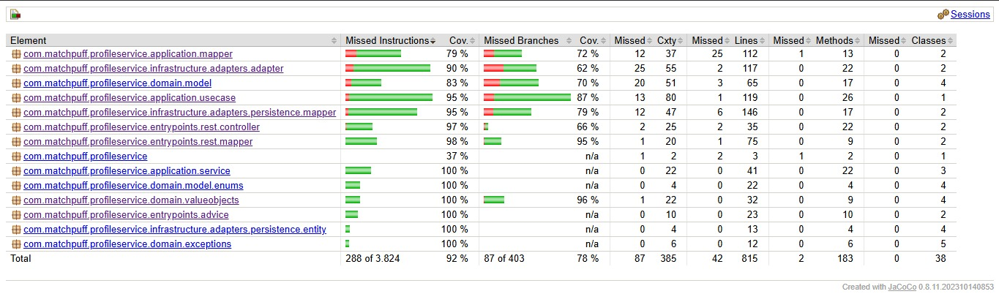

<div align="center">

# 🐾 Matchpuff — Microservicio de Perfiles

### *"Gestiona perfiles de estudiantes, organizadores y administradores en la plataforma Matchpuff"*

---

### 🛠️ Stack Tecnológico


### ☁️ Infraestructura & Calidad


### 🏗️ Arquitectura


</div>

---

## 📑 Tabla de Contenidos

1. [👤 Integrantes](#1--integrantes)
2. [🎯 Objetivo del Microservicio](#2--objetivo-del-microservicio)
3. [⚡ Funcionalidades Principales](#3--funcionalidades-principales)
4. [📋 Estrategia de Versionamiento y Branches](#4--manejo-de-estrategia-de-versionamiento-y-branches)
	- [4.1 Convenciones para crear ramas](#41-convenciones-para-crear-ramas)
	- [4.2 Convenciones para crear commits](#42-convenciones-para-crear-commits)
5. [⚙️ Tecnologías Utilizadas](#5--tecnologias-utilizadas)
6. [🧩 Funcionalidad](#6--funcionalidad)
7. [📊 Diagramas](#7--diagramas)
8. [⚠️ Manejo de Errores](#8--manejo-de-errores)
9. [🧪 Evidencia de Pruebas y Ejecución](#9--evidencia-de-las-pruebas-y-como-ejecutarlas)
10. [🗂️ Organización del Código](#10--codigo-de-la-implementacion-organizado-en-las-respectivas-carpetas)
11. [🚀 Ejecución del Proyecto](#11--ejecucion-del-proyecto)
12. [☁️ CI/CD y Despliegue en Azure](#12--evidencia-de-cicd-y-despliegue-en-Azure)
13. [🤝 Contribuciones](#13--contribuciones)

---

## 1. 👤 Integrantes:

Javier Mauricio Romero Deaquiz


Mariana Malagón


Andrés Cardozo Martinez


Jeimmy Vanessa Torres Marín


## 2. 🎯 Objetivo del microservicio

El microservicio de Perfiles tiene como objetivo gestionar la identidad y la información personal de los usuarios dentro de la plataforma Matchpuff. Este servicio administra la creación, actualización y eliminación de perfiles para tres tipos de usuario: **Estudiante**, **Organizador** y **Administrador**. Además, gestiona funcionalidades específicas del perfil estudiantil como horarios de disponibilidad, intereses (tags), foto de perfil (almacenada en Cloudinary), geolocalización y nivel de privacidad, garantizando una experiencia de perfil completa y segura para todos los usuarios de la plataforma.

---

## 3. ⚡ Funcionalidades principales

<div align="center">

<table>
  <thead>
    <tr>
      <th>💡 Funcionalidad</th>
      <th>Descripción</th>
    </tr>
  </thead>
  <tbody>
    <tr>
      <td><strong>Gestión de Usuarios</strong></td>
      <td>Crea, actualiza y elimina perfiles de usuarios tipo Estudiante, Organizador y Administrador con validaciones de negocio en el dominio.</td>
    </tr>
    <tr>
      <td><strong>Foto de Perfil</strong></td>
      <td>Permite subir y actualizar la imagen de perfil del estudiante, almacenándola en Cloudinary y guardando la URL resultante en la base de datos.</td>
    </tr>
    <tr>
      <td><strong>Horarios de Disponibilidad</strong></td>
      <td>Administra los horarios de disponibilidad del estudiante (día de la semana, hora de inicio y fin), permitiendo agregar y eliminar franjas.</td>
    </tr>
    <tr>
      <td><strong>Intereses (Tags)</strong></td>
      <td>Gestiona las etiquetas de interés del estudiante, permitiendo agregar y remover tags para personalizar su perfil.</td>
    </tr>
    <tr>
      <td><strong>Cambio de Contraseña</strong></td>
      <td>Permite al usuario cambiar su contraseña verificando la actual antes de aplicar el nuevo hash seguro.</td>
    </tr>
    <tr>
      <td><strong>Geolocalización</strong></td>
      <td>Activa o desactiva la geolocalización del estudiante. Solo disponible para usuarios de tipo STUDENT.</td>
    </tr>
    <tr>
      <td><strong>Consulta Interna</strong></td>
      <td>Expone un endpoint interno para que otros microservicios consulten datos de autenticación de usuarios por ID o por email.</td>
    </tr>
  </tbody>
</table>

</div>


## 4. 📋 Manejo de Estrategia de versionamiento y branches

### Estrategia de Ramas (Git Flow)

### Ramas y propósito
- Manejaremos GitFlow, el modelo de ramificación para el control de versiones de Git

#### `main`
- **Propósito:** rama **estable** con la versión final (lista para demo/producción).
- **Reglas:**
	- Solo recibe merges desde `release/*` y `hotfix/*`.
	- Cada merge a `main` debe crear un **tag** SemVer (`vX.Y.Z`).
	- Rama **protegida**: PR obligatorio, 1–2 aprobaciones, checks de CI en verde.

#### `develop`
- **Propósito:** integración continua de trabajo; base de nuevas funcionalidades.
- **Reglas:**
	- Recibe merges desde `feature/*` y también desde `release/*` al finalizar un release.
	- Rama **protegida** similar a `main`.

#### `feature/*`
- **Propósito:** desarrollo de una funcionalidad, refactor o spike.
- **Base:** `develop`.
- **Cierre:** se fusiona a `develop` mediante **PR**


#### `release/*`
- **Propósito:** congelar cambios para estabilizar pruebas, textos y versiones previas al deploy.
- **Base:** `develop`.
- **Cierre:** merge a `main` (crear **tag** `vX.Y.Z`) **y** merge de vuelta a `develop`.
- **Ejemplo de nombre:**  
  `release/1.3.0`

#### `hotfix/*`
- **Propósito:** corregir un bug **crítico** detectado en `main`.
- **Base:** `main`.
- **Cierre:** merge a `main` (crear **tag** de **PATCH**) **y** merge a `develop` para mantener paridad.
- **Ejemplos de nombre:**  
  `hotfix/fix-profile-photo`, `hotfix/fix-schedule-validation`


---

### 4.1 Convenciones para **crear ramas**

#### `feature/*`
**Formato:**
```
feature/[nombre-funcionalidad]
```

**Ejemplos:**
- `feature/gestionPerfiles`
- `feature/fotoDePerfilCloudinary`

**Reglas de nomenclatura:**
- Usar **PascalCase** (palabras separadas por mayúscula)
- Máximo 50 caracteres en total
- Descripción clara y específica de la funcionalidad

#### `release/*`
**Formato:**
```
release/[version]
```
**Ejemplo:** `release/1.0.0`

#### `hotfix/*`
**Formato:**
```
hotfix/[descripcion-breve-del-fix]
```
**Ejemplos:**
- `hotfix/corregirValidacionHorario`
- `hotfix/fixSubidaFoto`

---

### 4.2 Convenciones para **crear commits**

#### **Formato:**
```
[tipo]: [descripción específica de la acción]
```

#### **Tipos de commit:**
- `feat`: Nueva funcionalidad
- `fix`: Corrección de errores
- `docs`: Cambios en documentación

## 5. ⚙️ Tecnologías Utilizadas


| **Tecnología / Herramienta** | **Uso principal en el proyecto** |
|------------------------------|----------------------------------|
| **Java 21 (OpenJDK)** | Lenguaje de programación base del microservicio backend, con soporte a records, switch expressions y mejoras modernas. |
| **Spring Boot 3.4.5** | Framework principal para construir el microservicio, exponiendo APIs REST y gestionando configuración e inyección de dependencias. |
| **Spring Web** | Exposición de endpoints REST (controladores HTTP) dentro de la arquitectura hexagonal. |
| **Spring Security** | Configuración de seguridad del microservicio; protege endpoints en el perfil de producción. |
| **Spring Data MongoDB** | Integración del microservicio con MongoDB usando el patrón Repository y puertos/adaptadores. |
| **MongoDB** | Base de datos NoSQL principal para la colección `users` con subdocumentos de perfil, horarios y tags. |
| **Cloudinary** | Servicio externo de almacenamiento de imágenes para fotos de perfil de estudiantes. |
| **MapStruct 1.5.5** | Generación automática de mappers entre capas (DTO ↔ Dominio ↔ Persistencia). |
| **Apache Maven** | Gestión de dependencias, empaquetado del microservicio y automatización de builds en los pipelines CI/CD. |
| **Lombok** | Reducción de código repetitivo con anotaciones como `@Getter`, `@Builder`, `@Data` y `@RequiredArgsConstructor`. |
| **JUnit 5** | Framework de pruebas unitarias para validar la lógica de dominio y casos de uso en el microservicio. |
| **Mockito** | Simulación de dependencias (puertos, repositorios) en pruebas unitarias sin acceder a infraestructura real. |
| **Spring Security Test** | Soporte para pruebas de controladores con contexto de seguridad simulado. |
| **Swagger (OpenAPI 3 / springdoc 2.8.6)** | Generación automática de documentación y prueba interactiva de los endpoints REST. |
| **Spring Boot Actuator** | Exposición de endpoints de salud (`/actuator/health`) para monitoreo y healthchecks de Docker. |
| **Docker** | Contenerización del microservicio con build multi-stage y soporte HTTPS (SSL/TLS). |
| **Docker Compose** | Orquestación local de la aplicación para desarrollo y pruebas. |
| **Azure ECS (Fargate)** | Plataforma cloud donde se despliega el contenedor Docker del microservicio en producción. |
| **Amazon ECR** | Registro de contenedores Docker donde se almacenan las imágenes del microservicio. |
| **GitHub Actions** | Automatización de CI/CD: compilación, pruebas, análisis de cobertura y despliegue en Azure. |
| **SonarCloud** | Análisis estático de calidad de código y cobertura de pruebas. |
| **JaCoCo** | Generación de reportes de cobertura de pruebas integrados al pipeline CI. |


> 🧠 **Stack tecnológico seleccionado** para asegurar **escalabilidad**, **modularidad**, **seguridad**, **trazabilidad** y **mantenibilidad**, aplicando buenas prácticas de ingeniería de software.

## 6. 🧩 Funcionalidades

---

### 🔑 Funcionalidades principales

### 1️⃣ Crear Usuario Estudiante

Permite registrar un nuevo usuario con perfil de estudiante en el sistema.

**Endpoint principal:**  
`POST /api/v1/users/student`

---

### 📦 Estructura de la Solicitud (Request)

<div align="center">

| 🏷️ Campo | 🗃️ Tipo | ⚠️ Restricciones | 📝 Descripción |
|---|---|:---:|---|
| name | String | Obligatorio, 2–50 caracteres | Nombre completo del estudiante. |
| email | String | Obligatorio, formato `@escuelaing.edu.co` | Correo institucional del estudiante. |
| password | String | Obligatorio, mínimo 8 caracteres | Contraseña del usuario. |
| gender | Enum | Obligatorio | Género: `MALE`, `FEMALE`, `PREFER_NOT_TO_SAY`. |
| career | Enum | Obligatorio | Carrera: `SYSTEMS_ENGINEERING`, `COMPUTER_SCIENCE`, `INFORMATION_TECHNOLOGY`, `ADMINISTRATION`, `BUSINESS`. |
| semester | Integer | 1–10 | Semestre actual del estudiante. |
| studentCarnet | String | Obligatorio, exactamente 10 dígitos | Número de carné estudiantil. |
| photourl | String | Obligatorio | URL de la foto de perfil. |
| biography | String | Máximo 200 caracteres | Descripción personal del estudiante. |
| privacyLevel | Enum | Obligatorio | Nivel de privacidad: `PUBLIC`, `PRIVATE`, `FRIENDS_ONLY`. |
| dateOfBirth | LocalDate | Obligatorio, fecha pasada | Fecha de nacimiento del estudiante. |
| geolocationEnabled | Boolean | Obligatorio | Si la geolocalización está activa. |

</div>

---

### 📦 Estructura de la Respuesta (Response)

<div align="center">

| 🏷️ Campo | 🗃️ Tipo | 📝 Descripción |
|---|---|---|
| id | String | Identificador único del usuario. |
| name | String | Nombre del estudiante. |
| email | String | Correo electrónico. |
| gender | Enum | Género del usuario. |
| dateOfBirth | String | Fecha de nacimiento. |
| career | Enum | Carrera del estudiante. |
| semester | Integer | Semestre actual. |
| studentCarnet | String | Carné estudiantil. |
| photoUrl | String | URL de la foto de perfil. |
| biography | String | Biografía del estudiante. |
| privacyLevel | Enum | Nivel de privacidad. |
| geolocationEnabled | Boolean | Estado de la geolocalización. |
| schedules | List | Lista de horarios de disponibilidad. |
| tags | List | Lista de intereses/tags. |

</div>


---

### ✅(Ejemplo de Uso Exitoso)

1. El cliente envía un POST con los datos del estudiante.
2. El sistema valida todos los campos (email institucional, carné de 10 dígitos, semestre 1–10).
3. Se hashea la contraseña con el servicio de hashing.
4. Se persiste el usuario en MongoDB.
5. Se retorna `201 CREATED` con los datos del nuevo perfil.

**Request (Solicitud):**
```json
POST /api/v1/users/student

{
  "name": "Ana Torres",
  "email": "ana.torres@escuelaing.edu.co",
  "password": "SecurePass123",
  "gender": "FEMALE",
  "career": "SYSTEMS_ENGINEERING",
  "semester": 4,
  "studentCarnet": "1234567890",
  "photourl": "https://res.cloudinary.com/matchpuff/image/upload/v1/profile.jpg",
  "biography": "Estudiante apasionada por el desarrollo de software.",
  "privacyLevel": "PUBLIC",
  "dateOfBirth": "2002-03-15",
  "geolocationEnabled": true
}
```

**Response (Respuesta):**
```json
{
  "id": "507f1f77bcf86cd799439011",
  "name": "Ana Torres",
  "email": "ana.torres@escuelaing.edu.co",
  "gender": "FEMALE",
  "dateOfBirth": "2002-03-15",
  "career": "SYSTEMS_ENGINEERING",
  "semester": 4,
  "studentCarnet": "1234567890",
  "photoUrl": "https://res.cloudinary.com/matchpuff/image/upload/v1/profile.jpg",
  "biography": "Estudiante apasionada por el desarrollo de software.",
  "privacyLevel": "PUBLIC",
  "geolocationEnabled": true,
  "schedules": [],
  "tags": []
}
```

---

### 🖼️ Diagrama de Secuencia

*(Adjunta aquí el diagrama de secuencia para crear usuario estudiante)*

<details>
<summary><strong>🟢 Explicación del Flujo</strong></summary>

El proceso inicia cuando el cliente envía un POST al `UserController` con los datos del estudiante. El controlador mapea el request al modelo de dominio usando `UserRestMapper`. El `UserUseCase` hashea la contraseña, construye la entidad `StudentProfile` y la persiste en MongoDB a través del `UserRepositoryAdapter`. Se retorna la respuesta con el perfil creado.

</details>

---

### 📊 Tipos de errores manejados

<div align="center">

| 🔢 **Código HTTP** | ⚠️ **Escenario** | 💬 **Mensaje de Error** |
|:------------------:|:----------------|:------------------------|
|  | Email sin dominio institucional | `"email: must match .*@(mail\.)?escuelaing\.edu\.co$"` |
|  | Carné sin 10 dígitos | `"studentCarnet: The carnet must have exactly 10 digits"` |
|  | Semestre fuera de rango | `"Semester must be between 1 and 10"` |
|  | Campos obligatorios vacíos | `"Name is required"` |

</div>

---

### 2️⃣ Obtener Usuario por ID

Retorna los datos completos del perfil de un usuario según su identificador.

**Endpoint principal:**  
`GET /api/v1/users/{userId}`

---

### 📦 Estructura de la Respuesta (Response)

<div align="center">

| 🏷️ Campo | 🗃️ Tipo | 📝 Descripción |
|---|---|---|
| (objeto) | UserResponse | Datos completos del usuario (varía según tipo: Student, Admin, Organizer). |

</div>

---

### ✅Ejemplo de Uso Exitoso

1. El cliente envía un GET con el `userId` como path variable.
2. El sistema busca el usuario en MongoDB.
3. Se retorna `200 OK` con el perfil completo.

**Request (Solicitud):**
```
GET /api/v1/users/507f1f77bcf86cd799439011
```

---

### 🖼️ Diagrama de Secuencia

*(Adjunta aquí el diagrama de secuencia para obtener usuario por ID)*

---

### 📊 Tipos de errores manejados

<div align="center">

| 🔢 **Código HTTP** | ⚠️ **Escenario** | 💬 **Mensaje de Error** |
|:------------------:|:----------------|:------------------------|
|  | Usuario no existe | `"User not found: <userId>"` |

</div>

---

### 3️⃣ Subir Foto de Perfil

Permite al estudiante subir o actualizar su foto de perfil. La imagen se almacena en Cloudinary y la URL resultante se guarda en el perfil.

**Endpoint principal:**  
`POST /api/v1/users/{userId}/profile-image`

---

### 📦 Estructura de la Solicitud (Request)

<div align="center">

| 🏷️ Campo | 🗃️ Tipo | ⚠️ Restricciones | 📝 Descripción |
|---|---|:---:|---|
| file | MultipartFile | Obligatorio, `multipart/form-data` | Archivo de imagen a subir. |

</div>

---

### 📦 Estructura de la Respuesta (Response)

<div align="center">

| 🏷️ Campo | 🗃️ Tipo | 📝 Descripción |
|---|---|---|
| userId | String | ID del usuario actualizado. |
| photoUrl | String | URL pública de la imagen en Cloudinary. |

</div>

---

### ✅Ejemplo de Uso Exitoso

1. El cliente envía un POST con el archivo de imagen en `multipart/form-data`.
2. El sistema sube la imagen a Cloudinary.
3. Se actualiza el campo `photoUrl` en el perfil del estudiante.
4. Se retorna `200 OK` con la URL de la nueva imagen.

**Request (Solicitud):**
```
POST /api/v1/users/507f1f77bcf86cd799439011/profile-image
Content-Type: multipart/form-data
Body: file=<imagen.jpg>
```

**Response (Respuesta):**
```json
{
  "userId": "507f1f77bcf86cd799439011",
  "photoUrl": "https://res.cloudinary.com/matchpuff/image/upload/v1/abc123.jpg"
}
```

---

### 🖼️ Diagrama de Secuencia

*(Adjunta aquí el diagrama de secuencia para subir foto de perfil)*

<details>
<summary><strong>🟢 Explicación del Flujo</strong></summary>

El `UserController` recibe el `MultipartFile`, extrae los bytes y el tipo de contenido, y los pasa al `UserUseCase`. El caso de uso delega a `ImageStoragePort` (implementado por `CloudinaryAdapter`) para subir la imagen y obtener la URL. Luego actualiza el perfil del estudiante con la nueva URL y persiste el cambio.

</details>

---

### 📊 Tipos de errores manejados

<div align="center">

| 🔢 **Código HTTP** | ⚠️ **Escenario** | 💬 **Mensaje de Error** |
|:------------------:|:----------------|:------------------------|
|  | Error al leer el archivo | `"It was not possible to read the file. Please try again."` |
|  | Usuario no existe | `"User not found: <userId>"` |

</div>

---

### 4️⃣ Gestionar Horarios de Disponibilidad

Permite agregar o eliminar franjas de disponibilidad horaria del estudiante.

**Endpoints principales:**  
`PATCH /api/v1/users/{userId}/schedule` — Agregar horario  
`PATCH /api/v1/users/{userId}/schedule/remove` — Eliminar horario

---

### 📦 Estructura de la Solicitud (Request)

<div align="center">

| 🏷️ Campo | 🗃️ Tipo | ⚠️ Restricciones | 📝 Descripción |
|---|---|:---:|---|
| dayOfWeek | Enum | Obligatorio | Día de la semana (ej. `MONDAY`, `TUESDAY`, ...). |
| startTime | String | Obligatorio | Hora de inicio en formato `HH:mm`. |
| endTime | String | Obligatorio | Hora de fin en formato `HH:mm`. |

</div>

---

### ✅Ejemplo de Uso Exitoso

1. El cliente envía un PATCH con los datos del horario.
2. El sistema agrega (o elimina) la franja del perfil del estudiante.
3. Se retorna `200 OK` con el perfil actualizado.

**Request (Solicitud):**
```json
PATCH /api/v1/users/507f1f77bcf86cd799439011/schedule

{
  "dayOfWeek": "MONDAY",
  "startTime": "08:00",
  "endTime": "10:00"
}
```

---

### 🖼️ Diagrama de Secuencia

*(Adjunta aquí el diagrama de secuencia para gestión de horarios)*

---

### 📊 Tipos de errores manejados

<div align="center">

| 🔢 **Código HTTP** | ⚠️ **Escenario** | 💬 **Mensaje de Error** |
|:------------------:|:----------------|:------------------------|
|  | Datos inválidos | Errores de validación del request |
|  | Usuario no existe | `"User not found: <userId>"` |

</div>

---

### 5️⃣ Gestionar Intereses (Tags)

Permite agregar o eliminar etiquetas de interés del perfil del estudiante.

**Endpoints principales:**  
`PATCH /api/v1/users/{userId}/tags` — Agregar tag  
`PATCH /api/v1/users/{userId}/tags/remove` — Eliminar tag

---

### ✅Ejemplo de Uso Exitoso

1. El cliente envía un PATCH con los datos del tag.
2. El sistema agrega (o elimina) el tag del perfil del estudiante.
3. Se retorna `200 OK` con el perfil actualizado.

**Request (Solicitud):**
```json
PATCH /api/v1/users/507f1f77bcf86cd799439011/tags

{
  "name": "Programación",
  "description": "Interés en desarrollo de software"
}
```

---

### 🖼️ Diagrama de Secuencia

*(Adjunta aquí el diagrama de secuencia para gestión de tags)*

---

### 📊 Tipos de errores manejados

<div align="center">

| 🔢 **Código HTTP** | ⚠️ **Escenario** | 💬 **Mensaje de Error** |
|:------------------:|:----------------|:------------------------|
|  | Datos inválidos | Errores de validación del request |
|  | Usuario no existe | `"User not found: <userId>"` |

</div>

---

### 6️⃣ Cambio de Contraseña

Permite al usuario cambiar su contraseña proporcionando la contraseña actual y la nueva.

**Endpoint principal:**  
`PATCH /api/v1/users/{userId}/password`

---

### 📦 Estructura de la Solicitud (Request)

<div align="center">

| 🏷️ Campo | 🗃️ Tipo | ⚠️ Restricciones | 📝 Descripción |
|---|---|:---:|---|
| currentPassword | String | Obligatorio | Contraseña actual del usuario. |
| newPassword | String | Obligatorio | Nueva contraseña deseada. |

</div>

---

### ✅Ejemplo de Uso Exitoso

1. El cliente envía un PATCH con la contraseña actual y la nueva.
2. El sistema verifica que la contraseña actual sea correcta.
3. Se hashea la nueva contraseña y se persiste.
4. Se retorna `204 No Content`.

---

### 🖼️ Diagrama de Secuencia

*(Adjunta aquí el diagrama de secuencia para cambio de contraseña)*

---

### 📊 Tipos de errores manejados

<div align="center">

| 🔢 **Código HTTP** | ⚠️ **Escenario** | 💬 **Mensaje de Error** |
|:------------------:|:----------------|:------------------------|
|  | Contraseña actual incorrecta | `"Current password is invalid"` |
|  | Usuario no existe | `"User not found: <userId>"` |

</div>

---

### 7️⃣ Activar / Desactivar Geolocalización

Permite al estudiante activar o desactivar la geolocalización de su perfil.

**Endpoint principal:**  
`PATCH /api/v1/users/{userId}/geolocation`

---

### 📦 Estructura de la Solicitud (Request)

<div align="center">

| 🏷️ Campo | 🗃️ Tipo | ⚠️ Restricciones | 📝 Descripción |
|---|---|:---:|---|
| geolocationEnabled | Boolean | Obligatorio | `true` para activar, `false` para desactivar. |

</div>

---

### ✅Ejemplo de Uso Exitoso

1. El cliente envía un PATCH con el nuevo estado de geolocalización.
2. El sistema actualiza el campo `geolocationEnabled` del estudiante.
3. Se retorna `200 OK` con el perfil actualizado.

---

### 🖼️ Diagrama de Secuencia

*(Adjunta aquí el diagrama de secuencia para geolocalización)*

---

### 📊 Tipos de errores manejados

<div align="center">

| 🔢 **Código HTTP** | ⚠️ **Escenario** | 💬 **Mensaje de Error** |
|:------------------:|:----------------|:------------------------|
|  | Usuario no es estudiante | `"Only STUDENT users can update geolocation settings"` |
|  | Usuario no existe | `"User not found: <userId>"` |

</div>

---

## 7. 📊 Diagramas

Esta sección muestra los diagramas clave del microservicio de perfiles, ilustrando su arquitectura, componentes principales y despliegue.

---

### 🏗️ Diagrama de Componentes — Vista General


---

### 🔍 Diagrama de Componentes — Vista Específica


**Arquitectura Hexagonal:**  
El microservicio de Perfiles separa controladores, casos de uso, lógica de negocio y adaptadores externos para mantener modularidad y escalabilidad.

**Flujo principal:**

- **UserController / InternalUserController**
	- Reciben solicitudes HTTP y las delegan a los puertos de entrada correspondientes.

**Lógica de Negocio (Dominio):**

- **Caso de Uso (Application Layer)**
	- `UserUseCase` implementa `UserUseCasePort` y orquesta toda la lógica de creación, actualización, eliminación y consulta de usuarios.
	- `InternalUserService` expone operaciones internas de consulta de autenticación para otros microservicios.

**Integración y Adaptadores:**

- **Persistencia:**
	- `UserRepositoryAdapter` implementa el puerto de salida `UserRepositoryPort`.
	- Persiste en MongoDB en la colección `users` con documentos diferenciados por tipo (Student, Admin, Organizer).

- **Almacenamiento de Imágenes:**
	- `CloudinaryAdapter` implementa `ImageStoragePort` y gestiona la subida de fotos de perfil a Cloudinary.

- **Seguridad:**
	- `ProdSecurityConfig` y `DevSecurityConfig` configuran la seguridad según el perfil activo de Spring.

- **Manejo de Errores:**
	- `GlobalExceptionHandler` centraliza el manejo de excepciones de dominio y errores de validación.

> El microservicio de Perfiles gestiona todo el ciclo de vida de los usuarios de Matchpuff, integrándose con otros servicios del ecosistema a través de endpoints REST internos.


### 🔌 Servicios Externos Integrados

El microservicio se integra con otros sistemas del ecosistema Matchpuff.

<div align="center">

| 🌍 **Servicio** | ⚙️ **Operación** | 📋 **Propósito** |
|:---------------|:----------------|:-----------------------|
| **Cloudinary** | Subida de imágenes | Almacenamiento de fotos de perfil de estudiantes |
| **Microservicios internos** | Consulta por ID / email | Proveer datos de autenticación a otros servicios del ecosistema |

</div>

**Dominio y Mapeo:**

- Las entidades `User`, `StudentProfile`, `Admin` y `Organizer` encapsulan la lógica central.
- Los value objects `Email`, `PasswordHash`, `Biography` y `StudentCarnet` garantizan invariantes de negocio.

> El diagrama ilustra cómo el dominio de perfiles se mantiene aislado de la infraestructura, permitiendo cambiar la base de datos o los adaptadores externos sin afectar las reglas de negocio.


---
### 📊 Diagrama de base de datos



El microservicio de Perfiles utiliza **MongoDB** como motor de base de datos NoSQL. Contiene una colección principal: `users`, con subdocumentos embebidos diferenciados por tipo.

#### 📋 Colección: `users`

<div align="center">

| 🏷️ Campo | 🗃️ Tipo | 📝 Descripción | ⚠️ Restricciones |
|:---|:---|:---|:---|
| **_id** | `ObjectId` | Identificador único del usuario | Primary Key (auto) |
| **name** | `String` | Nombre completo del usuario | NOT NULL, 2–50 chars |
| **email** | `String` | Correo electrónico institucional | NOT NULL, Unique |
| **passwordHash** | `String` | Hash bcrypt de la contraseña | NOT NULL |
| **gender** | `String` | Género del usuario | NOT NULL |
| **dateOfBirth** | `LocalDate` | Fecha de nacimiento | Opcional |
| **verified** | `Boolean` | Si el usuario está verificado | NOT NULL, DEFAULT false |
| **createdAt** | `LocalDateTime` | Fecha de creación | NOT NULL |
| **userType** | `String` | Tipo de usuario (STUDENT, ADMIN, ORGANIZER) | NOT NULL |

</div>

##### Subdocumentos adicionales para STUDENT:

<div align="center">

| 🏷️ Campo | 🗃️ Tipo | 📝 Descripción | ⚠️ Restricciones |
|:---|:---|:---|:---|
| **career** | `String` | Carrera universitaria | NOT NULL |
| **semester** | `Integer` | Semestre actual | 1–10 |
| **studentCarnet** | `String` | Número de carné | 10 dígitos |
| **photoUrl** | `String` | URL de foto en Cloudinary | Opcional |
| **biography** | `String` | Biografía personal | Máx. 200 chars |
| **privacyLevel** | `String` | Nivel de privacidad | NOT NULL |
| **geolocationEnabled** | `Boolean` | Estado de geolocalización | NOT NULL |
| **schedules** | `Array<ScheduleDocument>` | Franjas de disponibilidad | Embebido |
| **tags** | `Array<TagDocument>` | Etiquetas de interés | Embebido |

</div>

##### Subdocumento: `ScheduleDocument`

<div align="center">

| 🏷️ Campo | 🗃️ Tipo | 📝 Descripción |
|:---|:---|:---|
| **dayOfWeek** | `String` | Día de la semana |
| **startTime** | `String` | Hora de inicio |
| **endTime** | `String` | Hora de fin |

</div>

##### Subdocumento: `TagDocument`

<div align="center">

| 🏷️ Campo | 🗃️ Tipo | 📝 Descripción |
|:---|:---|:---|
| **name** | `String` | Nombre del tag/interés |
| **description** | `String` | Descripción del interés |

</div>

---

### 📦 Diagrama de Clases del Dominio



**Resumen del diseño de dominio:**

La arquitectura de dominio se centra en la jerarquía de entidades de usuario.

- **Entidad Base:** `User` contiene los campos comunes: id, nombre, email, contraseña, género, fecha de nacimiento y estado de verificación.
- **Subtipos de Usuario:** `StudentProfile`, `Admin` y `Organizer` extienden `User`, cada uno con sus atributos específicos.
- **Value Objects:** `Email`, `PasswordHash`, `Biography` y `StudentCarnet` encapsulan validaciones de negocio dentro del valor mismo.
- **Enumeraciones:** `GenderEnum`, `CareerEnum` y `PrivacyLevelEnum` garantizan valores controlados en el dominio.

> Este diseño asegura la integridad de los datos de perfil y permite extender funcionalidades (nuevos tipos de usuario, nuevos campos) sin afectar las reglas de negocio centrales.


---

### 📦 DTOs Principales

<div align="center">
<div style="background:#111; color:#fff; border-radius:12px; padding:24px 12px; box-shadow:0 2px 12px #0002;">

<table style="border:2px solid #4A90E2; border-radius:8px;">
  <caption style="font-size:1.15em; font-weight:bold; color:#4A90E2; padding:8px;">📨 <u>Request DTOs</u></caption>
  <thead style="background:#222; color:#fff;">
    <tr>
      <th style="padding:8px;">DTO</th>
      <th style="padding:8px;">Atributos Principales</th>
      <th style="padding:8px;">Descripción</th>
    </tr>
  </thead>
  <tbody>
    <tr>
      <td><b>UserStudentRequest</b></td>
      <td>name, email, password, gender, career, semester, studentCarnet, photourl, biography, privacyLevel, dateOfBirth, geolocationEnabled</td>
      <td>Solicitud para registrar un nuevo estudiante. Valida email institucional, carné de 10 dígitos y semestre 1–10.</td>
    </tr>
    <tr>
      <td><b>UserAdminRequest</b></td>
      <td>name, email, password, gender, dateOfBirth</td>
      <td>Solicitud para registrar un nuevo administrador.</td>
    </tr>
    <tr>
      <td><b>UserOrganizerRequest</b></td>
      <td>name, email, password, gender, dateOfBirth</td>
      <td>Solicitud para registrar un nuevo organizador.</td>
    </tr>
    <tr>
      <td><b>UserStudentUpdateRequest</b></td>
      <td>name, biography, semester, privacyLevel, career</td>
      <td>Solicitud para actualizar datos básicos del estudiante.</td>
    </tr>
    <tr>
      <td><b>ChangePasswordRequest</b></td>
      <td>currentPassword, newPassword</td>
      <td>Solicitud para cambiar la contraseña verificando la actual.</td>
    </tr>
    <tr>
      <td><b>ScheduleRequest</b></td>
      <td>dayOfWeek, startTime, endTime</td>
      <td>Solicitud para agregar o eliminar una franja de disponibilidad.</td>
    </tr>
    <tr>
      <td><b>TagRequest</b></td>
      <td>name, description</td>
      <td>Solicitud para agregar o eliminar un tag de interés.</td>
    </tr>
    <tr>
      <td><b>GeolocationRequest</b></td>
      <td>geolocationEnabled</td>
      <td>Solicitud para activar o desactivar la geolocalización.</td>
    </tr>
  </tbody>
</table>

<br>

<table style="border:2px solid #43A047; border-radius:8px;">
  <caption style="font-size:1.15em; font-weight:bold; color:#43A047; padding:8px;">📤 <u>Response DTOs</u></caption>
  <thead style="background:#222; color:#fff;">
    <tr>
      <th style="padding:8px;">DTO</th>
      <th style="padding:8px;">Atributos Principales</th>
      <th style="padding:8px;">Descripción</th>
    </tr>
  </thead>
  <tbody>
    <tr>
      <td><b>UserResponse</b></td>
      <td>id, name, email, gender, createdAt</td>
      <td>Respuesta base para cualquier tipo de usuario.</td>
    </tr>
    <tr>
      <td><b>StudentProfileResponse</b></td>
      <td>id, name, email, gender, dateOfBirth, career, semester, studentCarnet, photoUrl, biography, privacyLevel, geolocationEnabled, schedules, tags</td>
      <td>Respuesta completa del perfil de un estudiante.</td>
    </tr>
    <tr>
      <td><b>AdminResponse</b></td>
      <td>id, name, email, gender</td>
      <td>Respuesta del perfil de un administrador.</td>
    </tr>
    <tr>
      <td><b>OrganizerResponse</b></td>
      <td>id, name, email, gender</td>
      <td>Respuesta del perfil de un organizador.</td>
    </tr>
    <tr>
      <td><b>UserResponseProfilePhoto</b></td>
      <td>userId, photoUrl</td>
      <td>Confirmación de subida de foto de perfil con URL de Cloudinary.</td>
    </tr>
    <tr>
      <td><b>UserAuthResponse</b></td>
      <td>id, email, passwordHash, userType</td>
      <td>Datos internos de autenticación expuestos solo a otros microservicios.</td>
    </tr>
  </tbody>
</table>

<br>

<table style="border:2px solid #F0AD4E; border-radius:8px;">
  <caption style="font-size:1.15em; font-weight:bold; color:#F0AD4E; padding:8px;">⚙️ <u>Enums del Dominio</u></caption>
  <thead style="background:#222; color:#fff;">
    <tr>
      <th style="padding:8px;">Enum</th>
      <th style="padding:8px;">Valores</th>
      <th style="padding:8px;">Descripción</th>
    </tr>
  </thead>
  <tbody>
    <tr>
      <td><b>CareerEnum</b></td>
      <td>SYSTEMS_ENGINEERING, COMPUTER_SCIENCE, INFORMATION_TECHNOLOGY, ADMINISTRATION, BUSINESS</td>
      <td>Carrera universitaria del estudiante.</td>
    </tr>
    <tr>
      <td><b>GenderEnum</b></td>
      <td>MALE, FEMALE, PREFER_NOT_TO_SAY</td>
      <td>Género del usuario.</td>
    </tr>
    <tr>
      <td><b>PrivacyLevelEnum</b></td>
      <td>PUBLIC, PRIVATE, FRIENDS_ONLY</td>
      <td>Nivel de privacidad del perfil del estudiante.</td>
    </tr>
    <tr>
      <td><b>DayOfWeekEnum</b></td>
      <td>MONDAY, TUESDAY, WEDNESDAY, THURSDAY, FRIDAY, SATURDAY, SUNDAY</td>
      <td>Días de disponibilidad en los horarios del estudiante.</td>
    </tr>
  </tbody>
</table>

</div>
</div>

---

### 🗄️ Diagrama de Despliegue



---

#### 🚀 Despliegue e Infraestructura

El microservicio de **Perfiles** se ejecuta como un contenedor Docker en **Azure**, respaldado por una arquitectura robusta de CI/CD.

- **Ejecución:** Contenedor Docker en Azure ECS con imagen almacenada en Amazon ECR.
- **Base de datos:** **MongoDB** con URI inyectada como variable de entorno `MONGO_URI`.
- **Almacenamiento de imágenes:** **Cloudinary** con credenciales configuradas por variables de entorno.
- **HTTP:** El servicio expone el puerto `8086` y deja el terminador TLS al ingress/plataforma.
- **CI/CD (GitHub Actions):**
	- Pruebas unitarias (JUnit 5) en cada PR a `develop` y `main`.
	- Despliegue automático a Azure ECS en merges a `main`.
	- Análisis de calidad de código con SonarCloud.
- **Construcción:** Dockerfile multi-stage (Maven Build → JRE 21 Alpine Runtime).
- **Configuración:** Variables de entorno gestionadas desde Azure Secrets/Environment.

<div align="center">	

| 🌐 **Componente** | 📝 **Descripción** |
|------------------|-------------------|
| Azure ECS Fargate | Hosting del contenedor Docker del microservicio |
| Amazon ECR | Registro privado de imágenes Docker |
| MongoDB Atlas / Azure | Base de datos NoSQL para perfiles de usuarios |
| Cloudinary | Almacenamiento de fotos de perfil |
| GitHub Actions | Automatización de CI/CD y calidad de código |
| Swagger UI | Documentación interactiva en `/swagger-ui.html` |

</div>


---

## 8. ⚠️ Manejo de Errores

El microservicio de **Perfiles** implementa un **mecanismo centralizado de manejo de errores** que garantiza uniformidad, claridad y seguridad en todas las respuestas enviadas al cliente cuando ocurre un fallo.

---

### 🧠 Estrategia general de manejo de errores

El sistema utiliza una **clase global** `GlobalExceptionHandler` con la anotación `@RestControllerAdvice` que intercepta todas las excepciones lanzadas desde los controladores REST. Cada excepción de dominio se transforma en una respuesta **JSON estandarizada** con el código HTTP apropiado.


---

### ⚙️ Global Exception Handler

El **Global Exception Handler** captura y maneja todas las excepciones del sistema de forma centralizada. Utiliza métodos con `@ExceptionHandler` para procesar cada tipo de error.

**✨ Características principales:**

- ✅ **Centraliza** la captura de excepciones desde todos los controladores
- ✅ **Retorna mensajes JSON consistentes** con el mismo formato estructurado (message, status)
- ✅ **Asigna códigos HTTP** según la naturaleza del error (400, 404, 409, 500)
- ✅ **Define mensajes descriptivos** que ayudan tanto al desarrollador como al usuario
- ✅ **Mantiene la aplicación limpia**, eliminando bloques try-catch redundantes
- ✅ **Mejora la trazabilidad** y facilita la depuración en entornos de prueba y producción


---

### 🧩 Excepciones de dominio manejadas

<div align="center">

| ⚠️ **Excepción** | 🔢 **HTTP** | 💬 **Escenario** |
|:----------------|:----------:|:----------------|
| `ProfileServiceException` | Variable (404, 400, etc.) | Excepción base de dominio con código HTTP configurable por caso de uso |
| `InvalidInputException` | 400 | Datos de entrada inválidos a nivel de dominio |
| `InvalidImageInputException` | 400 | Error al procesar o leer el archivo de imagen |
| `ImageProfileException` | Varía | Fallo al subir o gestionar la foto de perfil en Cloudinary |
| `UserAlreadyExistsException` | 409 | El email ya está registrado en el sistema |
| `MethodArgumentNotValidException` | 400 | Validación de campos del DTO fallida (`@NotBlank`, `@Email`, `@Pattern`, etc.) |
| `Exception` (genérica) | 500 | Error inesperado del servidor |

</div>

---

### ✅ Beneficios del manejo centralizado

<div align="center">

| 🎯 **Beneficio** | 📋 **Descripción** |
|:-----------------|:-------------------|
| **🎯 Uniformidad** | Todas las respuestas de error tienen el mismo formato JSON estandarizado |
| **🔧 Mantenibilidad** | Agregar nuevas excepciones no requiere modificar cada controlador |
| **🔒 Seguridad** | Oculta los detalles internos del servidor y evita exponer trazas sensibles |
| **📍 Trazabilidad** | Cada error incluye código HTTP y descripción del fallo; los errores inesperados se loguean con nivel ERROR |
| **🤝 Integración fluida** | Facilita la comunicación con frontend y herramientas como Postman/Swagger |

</div>

---

> Gracias a este enfoque, el microservicio de Perfiles logra un manejo de errores **robusto**, **escalable** y **seguro**, garantizando una experiencia de usuario más confiable y profesional.

---


---

## 9. 🧪 Evidencia de las pruebas y cómo ejecutarlas

El microservicio de **Perfiles** implementa una **estrategia integral de pruebas** que garantiza la calidad, funcionalidad y confiabilidad del código mediante pruebas unitarias cubiertas con JaCoCo.

---

### 🎯 Tipos de pruebas implementadas

<div align="center">

| 🧪 **Tipo de Prueba** | 📋 **Descripción** | 🛠️ **Herramientas** |
|:---------------------|:-------------------|:--------------------|
| **Pruebas Unitarias de Casos de Uso** | Validan el funcionamiento aislado del `UserUseCase` con mocks de puertos |   |
| **Pruebas de Dominio** | Verifican la lógica de negocio pura en las entidades y value objects (`User`, `StudentProfile`, `Email`, `Biography`, etc.) |  |
| **Pruebas de Controlador** | Validan los endpoints REST de `UserController` e `InternalUserController` con MockMvc |  |
| **Pruebas de Mappers** | Verifican el mapeo correcto entre capas usando `UserMapper`, `UserRestMapper` y `UserPersistenceMapper` |  |
| **Pruebas de Adaptadores** | Validan `UserRepositoryAdapter` y `CloudinaryAdapter` con mocks de dependencias externas |  |

</div>

---

### 🚀 Cómo ejecutar las pruebas

#### **1️⃣ Ejecutar todas las pruebas unitarias**

```bash
mvn test
```

#### **2️⃣ Ejecutar pruebas con reporte de cobertura JaCoCo**

```bash
mvn clean verify
```

#### **3️⃣ Ejecutar una prueba específica**

```bash
mvn test -Dtest=UserUseCaseTest
```

#### **4️⃣ Ejecutar pruebas desde IntelliJ IDEA**

1. Click derecho sobre la carpeta `src/test/java`
2. Selecciona **"Run 'Tests in...'**
3. Ver resultados en el panel inferior

---

### 🧪 Clases de prueba implementadas

<div align="center">

| 🧪 **Clase de Prueba** | 📋 **Qué valida** |
|:-----------------------|:------------------|
| `UserUseCaseTest` | Creación, actualización, eliminación y consulta de usuarios; gestión de horarios, tags, geolocalización y foto de perfil |
| `UserServiceTest` | Servicio de aplicación y delegación correcta al caso de uso |
| `InternalUserServiceTest` | Endpoints internos de consulta por ID y email |
| `UserControllerTest` | Todos los endpoints REST de `UserController` con MockMvc |
| `InternalUserControllerTest` | Endpoints de `InternalUserController` con MockMvc |
| `UserMapperTest` | Mapeos entre domain ↔ DTO en la capa de aplicación |
| `UserRestMapperTest` | Mapeos entre request/response REST ↔ dominio |
| `UserMapperTest (persistence)` | Mapeos entre dominio ↔ documentos de MongoDB |
| `UserRepositoryAdapterTest` | Adaptador de persistencia con mocks del repositorio MongoDB |
| `CloudinaryAdapterTest` | Adaptador de Cloudinary con mocks de la librería |
| `DomainModelsTest` | Validaciones de entidades `User`, `Admin`, `Organizer` |
| `StudentProfileTest` | Validaciones de negocio en `StudentProfile` |
| `BiographyTest`, `EmailTest`, `PasswordHashTest`, `StudentCarnetTest` | Validaciones de value objects del dominio |
| `GlobalExceptionHandlerTest` | Manejo centralizado de excepciones |
| `UserStudentRequestTest` | Validaciones de constraints del DTO de creación de estudiante |
| `ResponseDTOsTest`, `ScheduleAndTagResponseTest` | Validaciones de DTOs de respuesta |

</div>

---

### 🧪 Ejemplo de prueba unitaria

```java
@Test
@DisplayName("Crear estudiante hashea la contraseña y persiste el perfil")
void createStudentUser_shouldHashPasswordAndSave() {
    StudentProfile student = new StudentProfile();
    student.setPasswordHash("plainPassword");

    when(passwordHashingService.hashPassword("plainPassword")).thenReturn("$2a$10$hashedValue");
    when(userRepository.save(any())).thenReturn(student);

    User result = userUseCase.createStudentUser(student);

    verify(passwordHashingService).hashPassword("plainPassword");
    verify(userRepository).save(student);
    assertNotNull(result);
}
```

---

### 🖼️ Evidencias de ejecución



---

### ✅ Criterios de aceptación de pruebas

Para considerar el sistema correctamente probado, se debe cumplir:

- ✅ **Todas las pruebas en estado PASSED** (sin fallos)
- ✅ **Cero errores de compilación** en el código de pruebas
- ✅ **Pruebas de casos felices y casos de error** implementadas
- ✅ **Lógica de dominio** cubierta con pruebas de entidades y value objects
- ✅ **Reporte JaCoCo** generado en `target/site/jacoco/index.html`

---

## 10. 🗂️ Código de la implementación organizado en las respectivas carpetas

El microservicio de **Perfiles** sigue una **arquitectura hexagonal (puertos y adaptadores)** que separa las responsabilidades en capas bien definidas, promoviendo la escalabilidad, testabilidad y mantenibilidad del código.

---

### 📂 Estructura general del proyecto (Scaffolding)

```
matchpuff-profile-service/
│
├── 📁 src/
│   ├── 📁 main/
│   │   ├── 📁 java/com/matchpuff/profileservice/
│   │   │   │
│   │   │   ├── 📁 application/                              # 🔵 CAPA DE APLICACIÓN
│   │   │   │   ├── 📁 dto/
│   │   │   │   │   ├── 📁 request/   (UserStudentRequest, UserAdminRequest, UserOrganizerRequest,
│   │   │   │   │   │                  UserStudentUpdateRequest, UserAdminUpdateRequest,
│   │   │   │   │   │                  UserOrganizerUpdateRequest, ChangePasswordRequest,
│   │   │   │   │   │                  ScheduleRequest, ScheduleUpdateRequest,
│   │   │   │   │   │                  TagRequest, TagsUpdateRequest, GeolocationRequest)
│   │   │   │   │   └── 📁 response/  (UserResponse, StudentProfileResponse, AdminResponse,
│   │   │   │   │                      OrganizerResponse, ScheduleResponse, TagResponse,
│   │   │   │   │                      UserAuthResponse, UserResponseProfilePhoto)
│   │   │   │   ├── 📁 mapper/        (UserMapper)
│   │   │   │   ├── 📁 service/       (UserService, UserServicePort,
│   │   │   │   │                      InternalUserService, InternalUserServicePort,
│   │   │   │   │                      PasswordHashingService)
│   │   │   │   └── 📁 usecase/       (UserUseCase)
│   │   │   │
│   │   │   ├── 📁 domain/                                   # 🟢 CAPA DE DOMINIO
│   │   │   │   ├── 📁 exceptions/    (ProfileServiceException, InvalidInputException,
│   │   │   │   │                      InvalidImageInputException, ImageProfileException,
│   │   │   │   │                      UserAlreadyExistsException)
│   │   │   │   ├── 📁 model/         (User, StudentProfile, Admin, Organizer,
│   │   │   │   │                      Schedule, Tag)
│   │   │   │   │   └── 📁 enums/     (GenderEnum, CareerEnum, PrivacyLevelEnum, DayOfWeekEnum)
│   │   │   │   ├── 📁 ports/
│   │   │   │   │   ├── 📁 in/        (UserUseCasePort)
│   │   │   │   │   └── 📁 out/       (UserRepositoryPort, ImageStoragePort)
│   │   │   │   └── 📁 valueobjects/  (Email, PasswordHash, Biography, StudentCarnet)
│   │   │   │
│   │   │   ├── 📁 entrypoints/                              # 🟠 ENTRADA (DRIVING ADAPTERS)
│   │   │   │   ├── 📁 advice/        (GlobalExceptionHandler, ErrorResponse)
│   │   │   │   └── 📁 rest/
│   │   │   │       ├── 📁 controller/ (UserController, InternalUserController)
│   │   │   │       └── 📁 mapper/    (UserRestMapper)
│   │   │   │
│   │   │   └── 📁 infrastructure/                           # 🟠 INFRAESTRUCTURA (DRIVEN ADAPTERS)
│   │   │       ├── 📁 adapters/
│   │   │       │   ├── 📁 adapter/   (UserRepositoryAdapter, CloudinaryAdapter)
│   │   │       │   └── 📁 persistence/
│   │   │       │       ├── 📁 entity/   (UserDocument, StudentProfileDocument,
│   │   │       │       │                 AdminProfileDocument, OrganizerProfileDocument,
│   │   │       │       │                 ScheduleDocument, TagDocument, UserType)
│   │   │       │       ├── 📁 mapper/   (UserPersistenceMapper)
│   │   │       │       └── 📁 repository/ (UserRepository)
│   │   │       └── 📁 config/        (CloudinaryConfig, DevSecurityConfig, ProdSecurityConfig,
│   │   │                              MongoAuditingConfig, SwaggerConfig, StartupDependencyCheck)
│   │   │
│   │   └── 📁 resources/
│   │       ├── 📄 application.properties
│   │       └── 📄 application-prod.yml
│   │
│   └── 📁 test/                                             # 🧪 PRUEBAS
│       └── 📁 java/.../
│           ├── 📁 application/usecase/   (UserUseCaseTest)
│           ├── 📁 application/service/   (UserServiceTest, InternalUserServiceTest,
│           │                              PasswordHashingServiceTest)
│           ├── 📁 application/mapper/    (UserMapperTest)
│           ├── 📁 application/dto/       (UserStudentRequestTest, ResponseDTOsTest,
│           │                              ScheduleAndTagResponseTest)
│           ├── 📁 domain/model/          (DomainModelsTest, StudentProfileTest)
│           ├── 📁 domain/exceptions/     (InvalidInputExceptionTest, ProfileServiceExceptionTest,
│           │                              UserAlreadyExistsExceptionTest)
│           ├── 📁 domain/valueobjects/   (BiographyTest, EmailTest, PasswordHashTest,
│           │                              StudentCarnetTest)
│           ├── 📁 entrypoints/advice/    (ErrorResponseTest, GlobalExceptionHandlerTest)
│           ├── 📁 entrypoints/rest/controller/ (UserControllerTest, InternalUserControllerTest)
│           ├── 📁 entrypoints/rest/mapper/    (UserRestMapperTest)
│           └── 📁 infrastructure/adapters/    (UserRepositoryAdapterTest, CloudinaryAdapterTest,
│                                               UserMapperTest)
│
├── 📁 .Azure/                                                  # 🛠️ CONFIGURACIÓN Azure
│   └── 📄 task-definition.json
├── 📁 .github/workflows/                                     # 🔄 CI/CD
│   ├── 📄 ci.yml
│   ├── 📄 cd-Azure.yml
│   ├── 📄 cd-azure.yml
│   └── 📄 sonar.yml
├── 📄 Dockerfile
├── 📄 docker-compose.yml
├── 📄 pom.xml
└── 📄 README.md
```

---

> ℹ️ El código fuente está organizado siguiendo estrictamente la arquitectura hexagonal para garantizar la separación de responsabilidades y facilitar el mantenimiento y la extensión del sistema.

### 🏛️ Arquitectura Hexagonal Implementada

<div align="center">

| 🎨 **Capa** | 📋 **Responsabilidad** | 🔗 **Dependencias** |
|:-----------|:----------------------|:-------------------|
| **🟢 Domain** | Lógica de negocio pura, entidades (`User`, `StudentProfile`, `Admin`, `Organizer`), value objects, enums y puertos (interfaces) | ❌ Ninguna (independiente) |
| **🔵 Application** | Caso de uso `UserUseCase`, servicios de aplicación, DTOs y mappers | ✅ Solo `Domain` |
| **🟠 Entrypoints** | Controladores REST y manejador global de excepciones | ✅ `Domain` + `Application` |
| **🟠 Infrastructure** | Adaptadores MongoDB y Cloudinary, configuración de seguridad y Spring | ✅ `Domain` + `Application` |

</div>

**Flujo de dependencias:** `Entrypoints / Infrastructure → Application → Domain`

---

### 🎯 Principios de diseño aplicados

<div align="center">

| ✅ **Principio** | 📋 **Implementación** |
|:----------------|:---------------------|
| **Separación de responsabilidades** | Cada capa tiene un propósito único y bien definido |
| **Inversión de dependencias** | Las capas externas dependen de interfaces (puertos) definidas en el dominio |
| **Independencia del framework** | La lógica de negocio no depende de Spring ni de MongoDB |
| **Patrón Ports & Adapters** | El caso de uso consume puertos; la infraestructura los implementa |
| **Testabilidad** | Fácil crear pruebas unitarias mockeando puertos; controladores con MockMvc |
| **Mantenibilidad** | Cambios en una capa no afectan a las demás |

</div>  

---

## 11. 🚀 Ejecución del Proyecto

### 📋 Prerrequisitos
- **Java 21**
- **Maven 3.9+**
- **Docker & Docker Compose** (para ejecución containerizada)
- **MongoDB** (URI de conexión requerida)
- **Cloudinary** (credenciales requeridas para subida de imágenes)

### 🛠️ Opción 1: Ejecución Local (Maven)

```bash
# 1. Clonar repositorio
git clone https://github.com/<org>/matchpuff-profile-service.git

# 2. Copiar variables de entorno
cp .env.example .env
# Editar .env con tus credenciales reales

# 3. Ejecutar aplicación (perfil dev — sin SSL requerido)
mvn spring-boot:run
```

📍 **URL Local:** `http://localhost:8086`  
📚 **Documentación API:** `http://localhost:8086/swagger-ui.html`

### 🐳 Opción 2: Ejecución con Docker Compose

```bash
docker compose up --build
```

Esto levanta:
- `profile-service`: La aplicación en el puerto `8086` (HTTP)

### ⚙️ Variables de Entorno

| Variable | Valor por defecto | Descripción |
|:---------|:-----------------|:------------|
| `MONGO_URI` | *(requerido)* | URI de conexión a MongoDB |
| `MONGO_DB` | `profileservice` | Nombre de la base de datos |
| `CLOUDINARY_CLOUD_NAME` | *(requerido)* | Cloud name de Cloudinary |
| `CLOUDINARY_API_KEY` | *(requerido)* | API Key de Cloudinary |
| `CLOUDINARY_API_SECRET` | *(requerido)* | API Secret de Cloudinary |
| `SERVER_PORT` | `8086` | Puerto del servidor |
| `APP_STARTUP_FAIL_FAST` | `true` | Si la app falla al iniciar cuando no hay conexión a MongoDB |

## 12. ☁️ CI/CD y Despliegue en Azure

El proyecto implementa un **pipeline automatizado** con **GitHub Actions** para garantizar la calidad del código y el despliegue continuo en **Azure ECS**.

---

### 🔗 Enlaces de Despliegue


https://patricia-profile-service-gpcucxgpdub4azbw.canadacentral-01.azurewebsites.net/swagger-ui/index.html#/
<div align="center">

| 🌍 Ambiente | 📝 Estado |
|:-----------|:---------|
| **🟢 Producción (Azure ECS)** |  |

</div>

---

### 🔄 Pipeline de Automatización

El flujo de trabajo ejecuta los siguientes pasos en cada push o PR:

**CI (en PRs a `develop` y `main`, y pushes a `develop`):**

1. **Build & Test** — Compila el proyecto con Maven y ejecuta `mvn clean verify`.
2. **Cobertura JaCoCo** — Genera y sube el reporte de cobertura como artefacto de GitHub Actions.
3. **Docker Validation** — Construye la imagen Docker para verificar que el Dockerfile es correcto.
4. **SonarCloud** — Analiza la calidad y cobertura del código (pipeline separado `sonar.yml`).

**CD (en merges a `main`):**

1. **Login a Azure** — Configura credenciales de Azure con `Azure-actions/configure-Azure-credentials`.
2. **Build & Push a ECR** — Construye la imagen Docker y la sube a Amazon ECR.
3. **Deploy a ECS** — Actualiza la task definition y fuerza un nuevo despliegue en ECS con `Azure-actions/amazon-ecs-deploy-task-definition`.

---

### ☁️ Infraestructura

<div align="center">

| Componente | Servicio | Propósito |
|:-----------|:---------|:----------|
| **Compute** |  | Ejecución del contenedor Docker del microservicio en Fargate |
| **Registry** |  | Registro privado de imágenes Docker |
| **Database** |  | Persistencia de perfiles de usuarios |
| **Storage** |  | Almacenamiento de fotos de perfil |
| **CI/CD** |  | Automatización de pruebas y despliegue continuo |
| **Quality** |  | Análisis estático y cobertura de código |
| **API Docs** |  | Documentación interactiva de endpoints REST |

</div>

---

### 📊 Evidencias de Despliegue

*(Adjunta aquí las capturas de pantalla de Azure ECS y el pipeline de GitHub Actions)*

---

## 13. 🤝 Contribuciones y Metodología

El equipo **Matchpuff** aplicó la metodología **Scrum** con sprints semanales para garantizar una entrega incremental de valor y mejora continua.

### 👥 Equipo Scrum

| Rol | Responsabilidad |
|:---|:---|
| **Product Owner** | Priorización del Backlog y maximización de valor. |
| **Scrum Master** | Facilitador del proceso y eliminación de impedimentos. |
| **Developers** | Diseño, implementación y pruebas de funcionalidades. |

### 🔄 Eventos y Artefactos

- **Sprints Semanales**: Ciclos cortos de desarrollo.
- **Daily Scrum**: Sincronización diaria (15 min).
- **Sprint Review & Retrospective**: Demostración de incrementos y mejora de procesos.
- **Backlogs**: Gestión de tareas en GitHub Projects.

### 🎯 Valores del Equipo
Compromiso, Coraje, Enfoque, Apertura y Respeto fueron los pilares para afrontar desafíos técnicos como la arquitectura hexagonal con Spring Boot 3.4.5, la integración con Cloudinary, el despliegue en Azure ECS con HTTPS y el diseño de un microservicio de perfiles escalable.

---

<div align="center">

### 🐾 Equipo **Matchpuff**


> 💡 **Matchpuff Profile Service** es el microservicio encargado de gestionar la identidad y el perfil de todos los usuarios de la plataforma, siendo la base sobre la que se construyen las demás funcionalidades del ecosistema Matchpuff.

**🎓 Escuela Colombiana de Ingeniería Julio Garavito**

</div>

---